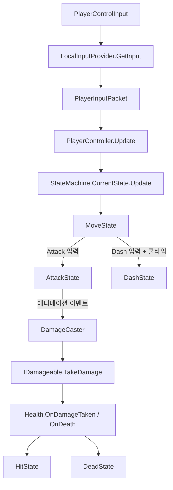

# 📚 Study Hub: Boss Raid Portfolio

이 문서는 현재 코드 기준(2026-02-21)으로, 플레이어 입력부터 전투 판정까지 "어디부터 어떻게" 따라갈지 정리한 학습 허브입니다.

---

## 1. 학습 목표

- 평일: 기능 구현 전에 코드 흐름을 빠르게 추적하고, 작업 단위를 작게 쪼개어 이해한다.
- 주말: 한 주 동안 바뀐 구조를 문서/다이어그램 관점에서 정리하고, 면접 설명 문장으로 압축한다.

---

## 2. 따라가기 순서 (현재 코드 기준)

| 단계 | 핵심 질문 | 우선 확인 파일 |
| --- | --- | --- |
| 1. 입력 패킷 계약 | "입력이 어떤 형태로 포장되는가?" | `Assets/Scripts/Player/PlayerInputData.cs` |
| 2. 로컬 입력 수집 | "Input System 값이 패킷으로 어떻게 변환되는가?" | `Assets/Scripts/Player/LocalInputProvider.cs`, `Assets/Scripts/Player/InputSystem/PlayerControlInput.inputactions` |
| 3. 컨트롤러 책임 분리 | "`PlayerController`는 무엇을 직접 하고, 무엇을 상태로 위임하는가?" | `Assets/Scripts/Player/PlayerController.cs` |
| 4. 상태머신 뼈대 | "상태 전환의 공통 계약은 무엇인가?" | `Assets/Scripts/Common/Patterns/StateMachine.cs`, `Assets/Scripts/Common/Patterns/BaseState.cs`, `Assets/Scripts/Player/PlayerBaseState.cs` |
| 5. 이동/대시 흐름 | "기본 루프와 대시 전환 조건은 무엇인가?" | `Assets/Scripts/Player/States/MoveState.cs`, `Assets/Scripts/Player/States/DashState.cs` |
| 6. 공격 콤보 흐름 | "콤보 예약, 캔슬, 종료 전환은 어떻게 동작하는가?" | `Assets/Scripts/Player/States/AttackState.cs`, `Assets/Scripts/Player/AttackComboData.cs` |
| 7. 피격/사망 흐름 | "데미지 이벤트가 상태 전환으로 어떻게 이어지는가?" | `Assets/Scripts/Common/Combat/Health.cs`, `Assets/Scripts/Player/States/HitState.cs`, `Assets/Scripts/Player/States/DeadState.cs` |
| 8. 판정 브리지 | "애니메이션 이벤트가 실제 데미지 판정으로 어떻게 연결되는가?" | `Assets/Scripts/Player/PlayerVisual.cs`, `Assets/Scripts/Common/Combat/DamageCaster.cs` |

---

## 3. 한눈에 보는 흐름 (간략 Mermaid)

---

## 4. 재진입 체크리스트 (2/4~2/5 이후 변경분 따라잡기)

- [ ] `MoveState`에서 점프 전환이 현재 비활성화된 이유와 조건을 확인한다.
- [ ] `AttackState`의 `_reserveNextCombo`, `cancelStartTime`, `CheckComboTransition()` 흐름을 손으로 순서도 그려본다.
- [ ] `PlayerVisual.OnHitStart/OnHitEnd -> PlayerController -> DamageCaster` 호출 체인을 브레이크포인트로 검증한다.
- [ ] `Health.OnDamageTaken/OnDeath` 이벤트가 `HitState/DeadState` 전환으로 연결되는 지점을 확인한다.
- [ ] 위 4가지를 "2분 설명 스크립트"로 정리해 면접 답변 초안 1개를 작성한다.

---

## 5. 주중/주말 운영 루틴

| 구분 | 권장 시간 | 할 일 |
| --- | --- | --- |
| 평일(구현 전) | 20~30분 | 오늘 건드릴 기능과 직접 연결된 단계 1개만 읽고, `Study Log`에 "이해/모름"만 기록 |
| 평일(구현 후) | 10분 | 변경된 파일 1~2개를 같은 날 로그에 추가하고, 다음 질문 1개만 남김 |
| 주말(정리) | 60~90분 | 로그를 합쳐서 "이번 주 핵심 흐름 3개"와 "다음 주 리스크 3개"로 압축 |

---

## 6. 기록 방법

1. 매 세션 시작 시 `docs/study/Study_Log_Template.md`를 복사해 날짜 파일을 만든다.
2. 파일명 예시: `docs/study/logs/2026-02-22_Study_Log.md`
3. 최소 4칸만 채운다:
   - 오늘 추적한 파일
   - 이해한 흐름
   - 막힌 지점
   - 다음 액션 1개

